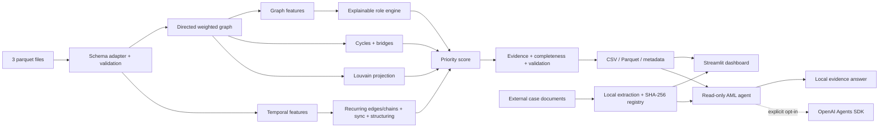

# Архитектура AML Graph Intelligence

## Границы компонентов

| Компонент | Ответственность |
|---|---|
| `src/data.py` | Schema aliases, типы, ссылки на GID, отрицательные значения |
| `src/graph.py` | Направленный взвешенный `DiGraph`; undirected projection только для communities |
| `src/features.py` | Flow metrics, PageRank, HITS, betweenness, components, seed proximity |
| `src/temporal.py` | Active days, forwarding delay, rapid pass-through, burst, synchronous inflows |
| `src/patterns.py` | Cycles 2–6, recurring edges/chains, structuring, depth-peer anomaly |
| `src/roles.py` | Пять независимых explainable scores и fallback `peripheral` |
| `src/clustering.py` | Louvain, bridge score, cluster summaries |
| `src/priority.py` | AML review priority, отдельно от уверенности в роли |
| `src/evidence.py` | Числовое объяснение роли ≤200 символов |
| `src/completeness.py` | Белые пятна наблюдения и следующий запрос по каждому GID |
| `src/agent.py` | Read-only инструменты, ответы аналитику, audit log |
| `src/documents.py` | Локальная загрузка PDF/DOCX/text, дедупликация, извлечение текста, GID-ссылки и поиск |
| `src/ui.py` | Токены светлой/тёмной темы, системный режим, сохранение выбора и общая настройка графиков |
| `src/validation.py` | Машинные контракты обязательных и bonus outputs |
| `app.py` | Demo-first интерфейс без бизнес-логики расчётов |

## Agentic AI

`AMLAnalystAgent` имеет пять read-only инструментов: рейтинг узлов, карточка GID, карточка кластера, AML-паттерны GID и поиск по локальным документам дела. Локальный evidence-agent всегда доступен и не передаёт данные наружу. OpenAI Agents SDK — опциональный режим с явным согласием пользователя; модель получает только строки, возвращённые выбранным инструментом, а не весь датасет или файл целиком. Документные фрагменты всегда помечаются как непроверенный пользовательский контекст и не могут переопределять pipeline-факты или инструкции агента.

Защита от галлюцинаций:

- фактические ответы строятся только из pipeline artifacts;
- неизвестный GID явно отклоняется;
- инструкции требуют разделять факт, гипотезу и рекомендацию;
- агент напоминает, что score не является доказательством нарушения;
- вопрос, режим, источники и latency пишутся в локальный `agent_audit.jsonl`.

## Масштабирование

Контракты признаков и выходов не зависят от NetworkX. Для ~1 млн узлов вычислительный слой заменяется на Polars/DuckDB + igraph/GraphFrames, exact betweenness — на sampling, а UI и агент продолжают читать те же агрегированные артефакты.
